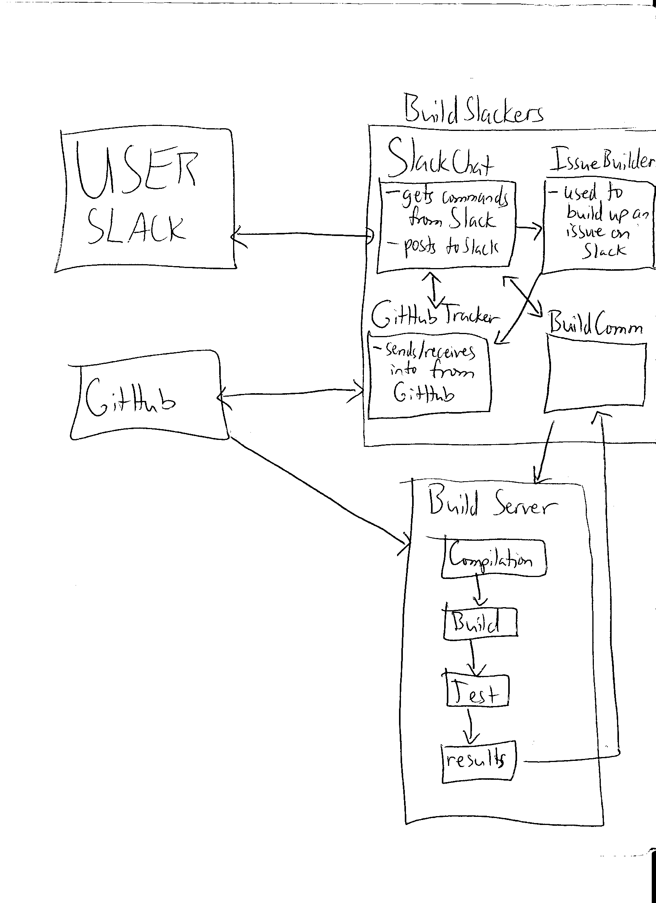

### Problem Statement

The cost of fixing issues has been shown to be proportional to how quickly the issue is discovered. Issues that are discovered late in the software development lifecycle have a higher time cost to fix than issues that are discovered earlier. Continuous integration attempts to discover issues as early as possible, by constantly building the software and running any automated tests. However, continuous integration can be a complicated process, and requires human effort to check on the state of the build and respond to any issues discovered. If a programmer makes a mistake and opens a pull request that does break the build, it can require a lot of needless effort to determine why the build broke, and the longer we go without fixing the issue the harder it will be to locate the problem later.

### Bot Description

Our bot, BuildSlackers, simplifies the continuous integration process to help developers deliver better, more reliable software. BuildSlackers can be triggered either through a message in slack, or a Pull Request on Github. BuildSlackers notifies users when a build has started, and when a build ends. If a build has ended successfully, it prompts the user to see if they want to merge the Pull Request, if it was triggered by one. If it was triggered through a Slack message, the bot simply notifies the user of success. If a build fails, BuildSlackers prompts the user to enter an issue in Github in order to track the reason for the failed build. The bot interacts with users exclusively through Slack. BuildSlackers falls into the category of a DevOps bot.

A bot is a good solution for this problem because it can reduce the complexity of configuring a build for developers. BuildSlackers will hide much of the complexity of configuring a continuous integration environment from developers. BuildSlackers will automatically alert the developers if a build breaks, so developers do not need to monitor the status of a build, but can spend their time doing other things. BuildSlackers also allows information about the builds to be seamlessly integrated into their conversations on slack, so the developers can quickly find the status of a build without needing to be at the server that performs the continuous integration. 
  
  
##### Design Documents

###### Wireframe

##### Storyboard

### Architecture Design

BuildSlackers will communicate with 3 different outside components, and so there is a component within BuildSlackers for each method of communication. SlackChat will be responsible for directly interfacing with the user through Slack. It will give the user feedback on the status of builds, as well as provide the user with the ability to start a build, merge branches on GitHub, and create an issue on GitHub for a failed build. SlackChat will not actually perform any of these actions; it will just provide the user a way to tell the bot to perform these actions. SlackChat will use IssueBuilder in order to build up an issue for GitHub.

IssueBuilder is responsible for making an issue on GitHub, and using SlackChat to gather the required data so that a new issue can be created. IssueBuilder will slowly build up the representation of an issue internally. Once it has all of the required information, it will use GitHubTracker to create the new issue.

GitHubTracker is responsible for watching the state of the project on GitHub, and merging branches and creating issues as necessary. Whenever a new pull request is created, it will notify SlackChat and BuildComm. GitHubTracker is responsible for using the GitHub REST API to interface with GitHub. 

BuildComm is responsible for communicating with the build server to kick off a build for the project, as well as receive the result (success/failure) of the attempted build and communicating this result back to SlackChat.

Constraints:
- The user only communicates through Slack.
- The bot will only build projects containing exclusively Java code.
- The bot will not generate any kind of unit tests, but only run given tests.
- The bot will require properly formatted user input which it will communicate to the user through Slack.
- The bot will only support a single server and a single project at any given time.
- The user can only trigger a build through Slack with a direct mention of the bot and the word "build".

##### Additional Patterns
Our bot will be very event driven, with actions being taken either as users use slack, pull requests are made on GitHub, or a build finishes. 
