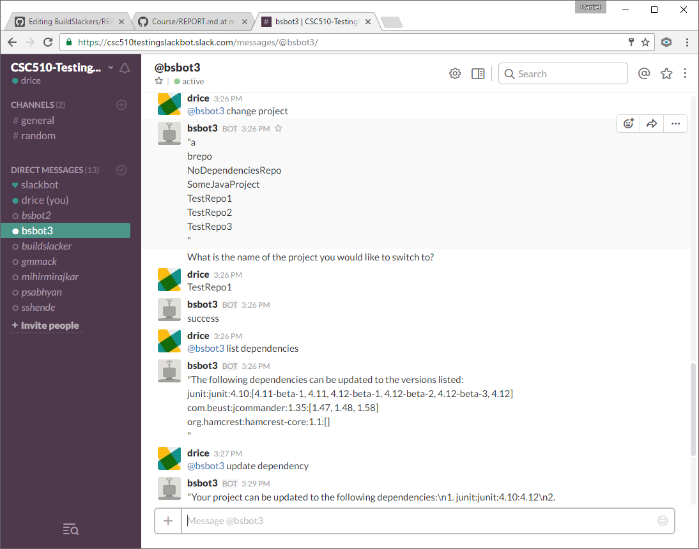
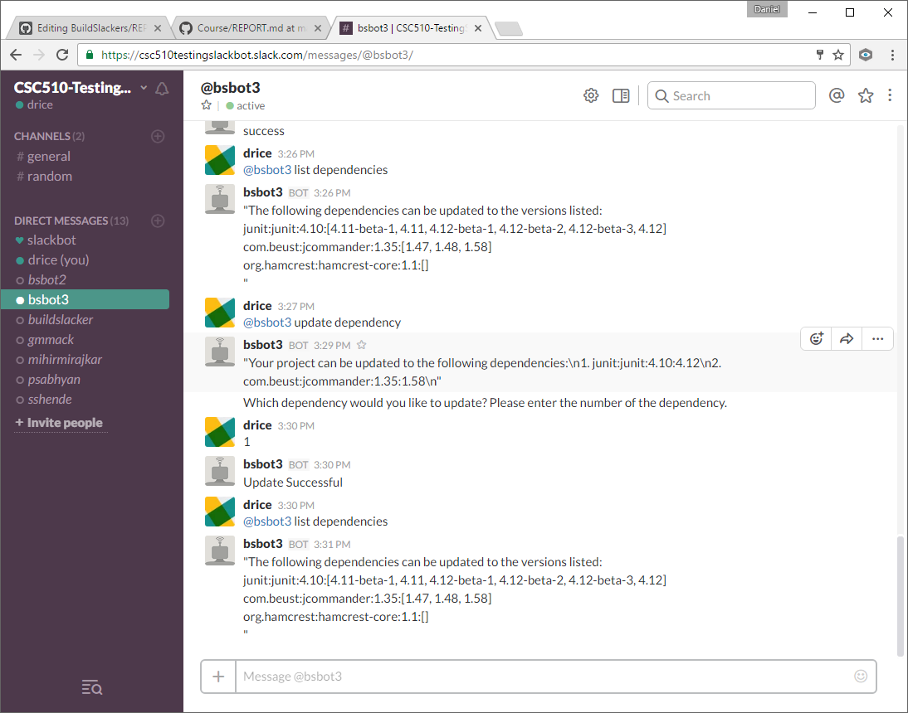
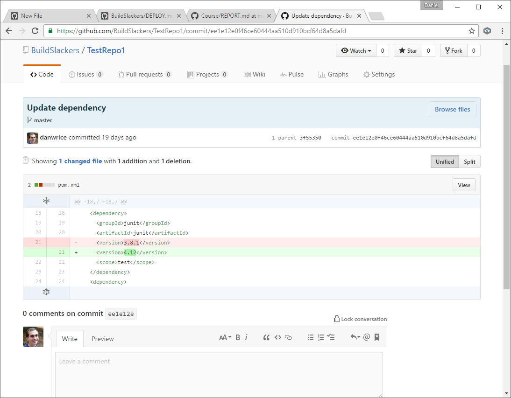

##### Screencast
Our [screencast](https://www.youtube.com/watch?v=DuXbmsDGaJw) talks about our bot, the problem it solves, and shows our 3 use cases.

##### Problem our bot solved

A basic fundamental need of software systems which evolve over time is the idea of "designing for failure". The gold standard for software availability is the "5 9's", meaning that the system will be up 99.999% of the time. Most big projects will have dependencies on third-party software. Those third-party software pieces will be updated over time, providing gains in performance, security, or reliability, among other things. To ensure your software is as up to date as possible, you will occasionally need to update your software so that it is using the latest version of any software it is dependent on.

According to one study, around 40% of java projects fail to compile because of dependency errors, whether that be having an incompatible version of a dependency, or because a dependency is missing. Dependencies are also updated constantly, and a developer might not have the time to stay up to date with the latest verions of those dependencies he is using in his project.

Incompatibility issues can often arise from updating versions of different dependencies in a software project, which leads to needless downtime. When this occurs, it can take a long time for developers to dig through every dependency that has been updated, identify the specific one that caused the build to break, and determine what needs to be done to fix it. Buildslackers automates this process so that the developer is relieved from the duty of updating the dependencies in a fashion that does not break the built.

##### Primary Features

For our bot, we implemented 3 use cases: 
1. Change which project the bot is monitoring
2. List the names, the current verion, and any newer versions available for each dependency in a project
3. Update a dependency to the latest version that passes any unit tests in the project

Our bot accepts commands through Slack, like so:

The BuildSlacker bot is capable of handling multiple repositories in an Organizational GitHub where multiple teams work on different projects, each in its repository of its own.  

In our bot, we were able to implement the ability to pull a project from a Github repository and check whether it had any dependencies with newer versions available.

If newer versions of dependencies are available, our bot checks those newer versions to make sure they are compatible with the project source code by using maven to upgrade dependencies, compile, and run any unit tests.

If the project is able to compile and pass all unit tests with newer versions of dependencies, our bot asks the user, through slack, which dependency the user wants to update. The bot then updates that dependency and pushes the code back up to Github.

Our bot allows the user to switch which Github repository for which to update dependencies, and is completely driven through Slack commands.

This will produce a commit on Github, which updates the pom.xml like the following: 

##### Reflections

The development process as a whole was spotty. Creating the mock data first, before trying to implement everything, definitely worked out well as it allowed us to focus on the front end user interaction at the beginning. Once we knew we had that done, we were able to leave it alone, and focus completely on the implementation of our project.
 While working on this project, we all were exposed to a whole new set of technologies. Our group meetings which helped us share a diverse prospective towards a single problem.
 
 It was a well balanced team as everyone knew what responsibiities they had. In every meeting each member took responsibility for developing a part of the project, no member was forced upon doing something which he didn't want to do as everyone took initiative to take up responsibilities. Whenever a member was stuck we helped each other out. Group meetings were very effective and communication between team member through slack was consistent. It seemed like an open enviroment where everyone knew the status of other team members work.
 
 Another thing that worked well was using Github issues and milestones as that allowed us to assign tasks to people and track our progress. However, sometimes due to some unaviodable circumstances of other members we were left behind the milestone. During such times other team members were very helpful and helped the member who was lagging behind the milestone. Sometimes we failed to complete issues in the milestone we were supposed to, and everything got left until the end of deliverable before it was completed. This lead to some frustrating nights, and decreased productivity and a slightly worse implementation, because when it came to crunchtime, we had to work just to get the basic functionality rather than being able to modify, enhance, and make our bot more sturdy. 
 
 
  
##### Limitations and Future Work

Our bot has several limitations which will provide for future work:  
1. We can only track one Github project at a time, so a user will have to continuously tell our bot to switch projects in order to update all of the user's projects.  
2. Our bot requires the pom.xml file to be in the root of the Github repository. We are unable to find any pom.xml that is within a directory.  
3. Our bot can only update one dependency at a time - it would be nice to find the maximum versions of each dependency in a project that can be updated together and update all of them at the same time. While this does provide some   
interesting questions (such as if versions of two dependencies are incompatible with each other, which dependency should we update, and which should we leave as is) we could find a way to work around this.  
4. Our bot is also unable to be configured with a different user/organization's Github credentials. The future work would be to allow the user to update the bot, and switch which Github user/organization it acts as.  
5. Our bot requires that no updates be made to the project while it is trying to update dependencies. This could lead to merge conflicts on Github. We need to have the bot refresh his copy of the project locally before committing to Github.  
6. Our bot can only be run on Linux machines. We need to configure it to identify whether it is on a Windows or Linux machine, and then take the necessary actions for the type of machine it is on.  
7. Our bot is unable to deal with branches. We would like our bot to checkout a specific branch which the user could specify, rather than just the master branch.  
8. Our bot right now takes commands and reacts on it. It is basically a reactor bot. We would like it to be a responder bot where it moniters any activities on github and respond if some events like new dependencies added or something of that sort and the bot would tell the developer whether the dependency added could be updated to a newer version.
9. Our bot also can only update to the latest version of a dependency, rather than allowing a user to specify which version of a dependency to update to.
